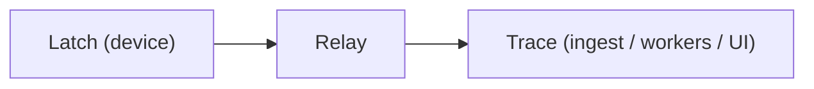

# LastState Trace

Observability backend for embedded firmware and hardware fleets. Ingests LEP
envelopes from Relay, fingerprints crashes into issues, symbolicates against
uploaded ELF artifacts, and serves the web UI operators use every day.



## Run it

The fastest path is the full stack, not this repo alone:

```bash
git clone --recurse-submodules https://github.com/laststate/laststate.git
cd laststate
docker compose up -d
# UI → http://localhost:8080
```

To run Trace standalone you need Postgres 16 and an S3-compatible store
(MinIO works). With those up:

```bash
TRACE_DEPLOYMENT=local go run ./cmd/trace      # Linux / macOS
set TRACE_DEPLOYMENT=local && go run .\cmd\trace  REM Windows
```

On first boot Trace writes bootstrap credentials once, next to its data dir.
The token value itself is never logged:

| File | Contents |
|------|----------|
| `data/bootstrap-token.txt` | Ingest bearer token |
| `data/bootstrap-admin.txt` | Admin email + password |

> [!IMPORTANT]
> UI routes require authentication by default (`TRACE_OPEN_UI=false`). If you
> expose `:8080` beyond localhost, keep it that way and put TLS in front
> (Caddy, Traefik, Nginx). There is no anonymous admin.

## Deployment modes

`TRACE_DEPLOYMENT` selects how the server behaves:

| Mode | Who runs it | Auth | Quotas | Billing |
|------|-------------|------|--------|---------|
| `local` | You (self-hosted) | Not required | Off | Hidden ("everything unlocked") |
| `enterprise` | LastState (managed) | Required | Enforced | Active (tiers, subscribe) |

Default is `enterprise` (secure). `local` bypasses UI auth, skips ingest
quotas, forces `TRACE_OPEN_UI=true` with public registration, and returns a
single "everything unlocked" tier so billing pages render without login.
Enterprise keeps auth required, quotas enforced, and the billing catalog
visible. Payments are served by the proprietary `laststate/billing-service`
over an HMAC admin API; `GET /v1/billing/*` and `GET /v1/usage` are wired
in-repo and deployment-aware.

> [!WARNING]
> `local` disables authentication and quotas by design. It is for development
> and single-tenant self-hosting behind your own access control — never for a
> multi-tenant or internet-facing deploy. Production runs `enterprise`.

## Architecture

One binary, three shapes selected by `TRACE_MODE`:

| Mode | Role |
|------|------|
| `TRACE_MODE=all` | API + workers (default) |
| `TRACE_MODE=api` | HTTP only (stateless, scales horizontally) |
| `TRACE_MODE=worker` | Job consumers + retention GC |

Queue backend (`TRACE_QUEUE`):

| Backend | Notes |
|---------|-------|
| `postgres` | Default; durable `SKIP LOCKED`, no extra service |
| `redis` | LIST + HASH + lease reclaim (`TRACE_QUEUE_URL`) |
| `memory` | Single-process tests only |
| `nats` | In-process simulator only (`TRACE_QUEUE_URL=memory`) |
| `cf` | Cloudflare Queues HTTP adapter (no silent RAM fallback) |

Every response carries `X-Trace-ID` / `X-Span-ID`.

### Event pipelines

| Event types | Pipeline | Side effects |
|-------------|----------|--------------|
| crash / error / coredump | `issue` | fingerprint, issue, alerts |
| health | `health` | health samples, device health |
| log / message | `log` | log entries |
| peripheral | `metric` | metric samples |
| reset | `boot` | boot sessions |

Workers are idempotent: a worker crash never duplicates an issue (dedupe by
event id). Raw payloads and ELF symbols live in S3/MinIO; everything indexed
lives in Postgres.

## Web UI

```bash
cd web && npm ci && npm run build
```

- React Router paths: `/overview`, `/issues/:id`, …
- Brand assets: `assets/brand/` (served as `/assets/brand/*`)
- E2E: `cd web && npm run test:e2e` (UI shell; full stack in [docs/E2E.md](docs/E2E.md))

### Mock mode

UI development with realistic fake data, no DB or services:

```bash
TRACE_MOCK=true go run ./cmd/trace      # Linux / macOS
set TRACE_MOCK=true && go run .\cmd\trace  REM Windows

./scripts/mock-preview.sh   # Linux / macOS
scripts\mock-preview.bat    # Windows
```

Mock serves a pre-populated dashboard, fake-but-plausible API responses and
deterministic charts, with auth bypassed (auto-logged in as admin).

> [!NOTE]
> Mock data is deterministic by design. Use it for UI work and demos, not
> for integration tests — point those at `enterprise` with test keys.

## Security defaults

- Public registration off (`TRACE_ALLOW_PUBLIC_REGISTER=false`)
- OIDC requires existing membership (`TRACE_OIDC_AUTO_JOIN=false`)
- SAML ACS experimental (`TRACE_SAML_INSECURE` forbidden in production)
- Session cookie: HttpOnly, `SameSite=Lax`, optional Secure
- `X-Forwarded-For` honored only from `TRACE_TRUSTED_PROXIES`
- Channel/alert secrets encrypted when `TRACE_SECRETS_KEY` is set

See [SECURITY.md](SECURITY.md).

## Ops

```bash
./scripts/backup.sh ./backups/run1
./scripts/restore.sh ./backups/run1

TRACE_E2E_URL=http://localhost:8080 TRACE_E2E_TOKEN=… \
  go test -tags e2e ./scripts -count=1
```

- Helm: `deploy/helm/trace/` (API + worker, Secret, backup PVC). Tagged
  releases also publish the chart to `oci://ghcr.io/laststate/charts` and the
  image to `ghcr.io/laststate/trace` (see `.github/workflows/release.yml`).
- OpenAPI: `GET /openapi.json`
- More docs: [BACKUP_RESTORE.md](docs/BACKUP_RESTORE.md),
  [OBSERVABILITY.md](docs/OBSERVABILITY.md), [SCALE.md](docs/SCALE.md),
  [DEPLOYMENT.md](docs/DEPLOYMENT.md), [SELF_HOSTING.md](docs/SELF_HOSTING.md)

## Protocol

LEP wire format is implemented in `internal/lep`, aligned with
[laststate/protocol](https://github.com/laststate/protocol). When this repo
and the spec disagree on a byte, the spec wins.

## License

AGPL-3.0 for this repository. The edge stack (protocol, Latch, Relay) is
Apache-2.0.

> [!IMPORTANT]
> Shipping Trace as a network service triggers AGPL §13: every network user
> is entitled to the Corresponding Source, including your modifications. A
> closed SaaS on top of Trace needs a commercial license from the copyright
> holders. Running it unmodified for your own use does not.
