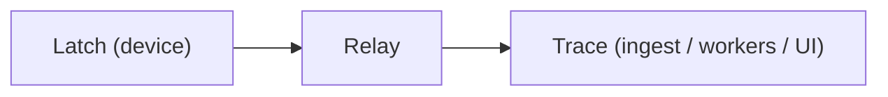

# Last State Trace

Observability backend for embedded firmware and hardware fleets.



## Quickstart

```bash
docker compose up --build
```

Bootstrap credentials (written once, never fully logged):

| File | Contents |
|------|----------|
| `data/bootstrap-token.txt` | Ingest bearer token |
| `data/bootstrap-admin.txt` | Admin email + password |

UI APIs require authentication by default (`TRACE_OPEN_UI=false`).

## Deployment modes: local vs enterprise

`TRACE_DEPLOYMENT` selects how the server behaves:

| Mode | Who runs it | Auth | Quotas | Billing / paywall |
|------|-------------|------|--------|-------------------|
| `local` | You (self-hosted) | Not required | Off | Hidden ("everything unlocked") |
| `enterprise` | LastState (managed SaaS) | Required | Enforced | Active (tiers, subscribe) |

Default is `enterprise` (secure). To self-host with everything unlocked:

```bash
# Linux / macOS
TRACE_DEPLOYMENT=local go run ./cmd/trace

# Windows
set TRACE_DEPLOYMENT=local && go run .\cmd\trace
```

Local mode:
- Bypasses mandatory auth on all UI routes (`requireUI` / `requireAuth` pass through)
- Disables ingest quotas (`quotaMiddleware` is skipped)
- Forces `TRACE_OPEN_UI=true` and `TRACE_ALLOW_PUBLIC_REGISTER=true`
- Billing endpoints return a single "everything unlocked" tier and the UI hides the paywall / subscription prompts
- The active org is resolved from the default project, so usage/billing pages work without logging in

Enterprise mode keeps the current behavior: auth required, quotas enforced, billing catalog + paywall shown. Billing payments are served by the proprietary `laststate/billing` service (HMAC admin API); `GET /v1/billing/*` and `GET /v1/usage` are wired in-repo and deployment-aware.

## Architecture

| Mode | Role |
|------|------|
| `TRACE_MODE=all` | API + workers (default) |
| `TRACE_MODE=api` | HTTP only |
| `TRACE_MODE=worker` | Job consumers + retention GC |

| Queue (`TRACE_QUEUE`) | Notes |
|-----------------------|--------|
| `postgres` | Default; durable `SKIP LOCKED` |
| `redis` | LIST + HASH + lease reclaim (`TRACE_QUEUE_URL`) |
| `memory` | Single-process tests |
| `nats` | In-process simulator only (`TRACE_QUEUE_URL=memory`) |
| `cf` | Cloudflare Queues HTTP adapter (no silent RAM fallback) |

Every response includes `X-Trace-ID` / `X-Span-ID`.

## Security defaults

- Public registration off (`TRACE_ALLOW_PUBLIC_REGISTER=false`)
- OIDC requires existing membership (`TRACE_OIDC_AUTO_JOIN=false`)
- SAML ACS experimental (`TRACE_SAML_INSECURE` forbidden in production)
- Session cookie: HttpOnly, `SameSite=Lax`, optional Secure
- `X-Forwarded-For` only from `TRACE_TRUSTED_PROXIES`
- Channel/alert secrets encrypted when `TRACE_SECRETS_KEY` is set

See [SECURITY.md](SECURITY.md).

## Pipelines

| Event types | Pipeline | Side effects |
|-------------|----------|--------------|
| crash / error / coredump | `issue` | fingerprint, issue, alerts |
| health | `health` | health samples, device health |
| log / message | `log` | log entries |
| peripheral | `metric` | metric samples |
| reset | `boot` | boot sessions |

## Web UI

```bash
cd web && npm ci && npm run build
```

- React Router paths: `/overview`, `/issues/:id`, …
- Brand assets: `assets/brand/` (served as `/assets/brand/*`)
- Playwright: `cd web && npm run test:e2e` (UI shell; see [docs/E2E.md](docs/E2E.md) for full stack)

### Mock / Preview Mode

Start the UI with realistic fake data, no DB or services required:

```bash
# Linux / macOS
TRACE_MOCK=true go run ./cmd/trace

# Windows
set TRACE_MOCK=true && go run .\cmd\trace

# Or use the convenience scripts
./scripts/mock-preview.sh   # Linux / macOS
scripts\mock-preview.bat    # Windows
```

Mock mode serves:
- Pre-populated dashboard with realistic event/issue/device data
- All API endpoints return fake but realistic responses
- Charts render with deterministic data (same across restarts)
- Authentication is bypassed — you're auto-logged in as admin

Useful for:
- UI/UX development without infra
- Demos and presentations
- Testing frontend changes against realistic data
- Prototyping new views before backend is ready

## Ops

```bash
./scripts/backup.sh ./backups/run1
./scripts/restore.sh ./backups/run1

TRACE_E2E_URL=http://localhost:8080 TRACE_E2E_TOKEN=… \
  go test -tags e2e ./scripts -count=1
```

- Helm: `deploy/helm/trace/` (API + worker, Secret, backup PVC)
- OpenAPI: `GET /openapi.json` (version **0.8.0**)
- More docs: [BACKUP_RESTORE.md](docs/BACKUP_RESTORE.md), [OBSERVABILITY.md](docs/OBSERVABILITY.md), [SCALE.md](docs/SCALE.md)

## Protocol

LEP v1 wire format is implemented in `internal/lep`, aligned with [laststate/protocol](https://github.com/laststate/protocol).

## License

AGPL-3.0 for this repository.

Edge stack (protocol, Latch, Relay) is Apache-2.0. Shipping a closed-source SaaS
on top of Trace requires AGPL compliance (source offer to network users or a
commercial license from the copyright holders).
